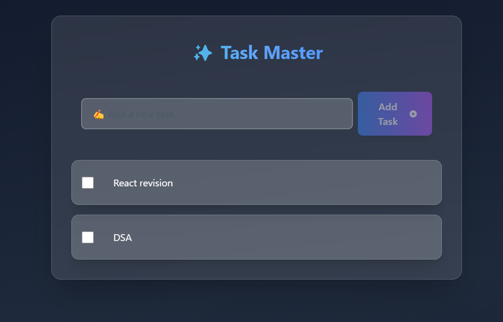

# Task Master App 🚀

### A Modern To-Do List App built with React.js

Task Master is a simple yet modern **To-Do List App** designed to help users manage their tasks efficiently. The app leverages **React.js hooks** and **Local Storage** to deliver a seamless user experience.

## 🔑 Features
- ✅ Add Task
- 📝 Edit Task
- ❌ Delete Task
- ✔️ Mark Task as Complete
- 🔄 Cancel Task
- 🌐 Persistent Data with Local Storage
- 🎨 Modern UI (Designed by **Claude**)

## 🛠️ Tech Stack
- React.js
- useState
- useEffect
- useRef
- useCallback
- useContext
- Local Storage

## 📸 Preview


---

## How to Run Locally
```bash
# Clone the Repository
git clone https://github.com/dhruvbajpai/TaskMaster-App
cd task-master-app

# Install Dependencies
npm install

# Start the Development Server
npm start
